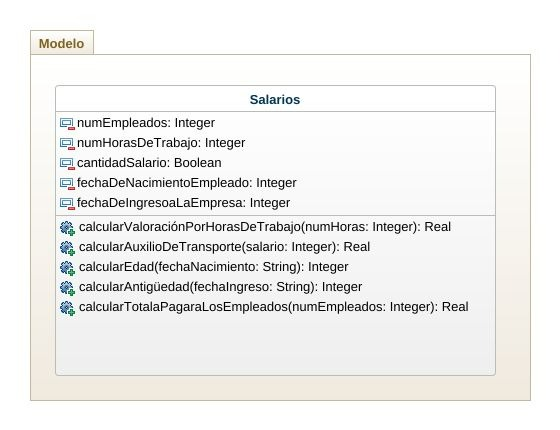

# Empresa

### Una empresa desea concocer el total a pagar por concepto de salarios a sus empleados. Cada empleado trabaja un número de horas mensuales y recibe una valoración por esa hora de trabajo. Sí el empleado gana menos de dos salarios mínimos, entonces, recibe auxilio de transaporte. Adicionalmente, se desea calcular la edad del empleado a partir de su fecha de nacimiento y antigedad del empleado utilizando su fecha de ingreso a la empresa.

